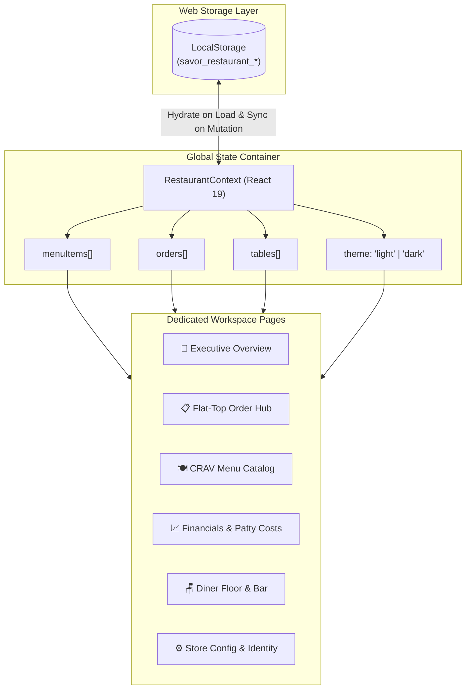

<div align="center">

# 🍔 CRAV BURGER — Smashed Fresh, Bold Flavor
### Enterprise Restaurant Management & Flat-Top Kitchen Dispatch OS

[](https://react.dev/)
[](https://vite.dev/)
[](LICENSE)
[](https://crav-burger.framer.website/)
[]()

<p align="center">
  A high-performance, full-featured restaurant management and kitchen display system (KDS) engineered with <strong>React 19</strong>, modular CSS variables, and persistent <strong>LocalStorage</strong> state synchronization.
  <br />
  Designed with the bold, retro-modern culinary aesthetic inspired by <a href="https://crav-burger.framer.website/"><strong>CRAV Burger</strong></a> (Est. 1997 — Navarra, España).
</p>

[Explore Live Demo](#-quick-start) • [Architecture](#-architecture--data-flow) • [Features](#-core-features) • [Installation](#-quick-start) • [License](#-license)

---

</div>

## 🌟 Project Highlights

- 🍔 **CRAV Culinary Branding**: Authentic color palette featuring **Toasted Brioche & Butter** light mode (`#F5E3CD`, `#DE3618`, `#FDB813`) alongside **Charred Flat-Top** dark mode (`#120C08`), paired with ultra-bold display typography.
- 📑 **Dedicated Multi-Page Workspaces**: No cluttered single-page sprawl. Each operational workflow (Overview, Kitchen Pipeline, Menu Catalog, Financial Audit, Seating Floor Plan, and Settings) operates on its own dedicated, isolated workspace with custom breadcrumbs and toolbars.
- 📋 **Live Flat-Top Kanban Pipeline**: Visual 4-stage order pacing (*Pending Kitchen* ➔ *In Kitchen Prep* ➔ *Ready to Serve* ➔ *Completed & Billed*) with 1-click status advancement and printable thermal kitchen tickets.
- 🍽️ **Full Menu CRUD & Instant Stock Toggling**: Add, edit, and delete dishes with form validations, recipe prep times, calorie counts, culinary photography presets, and immediate out-of-stock switches.
- 📈 **Custom SVG Financial Trajectory Engine**: Handcrafted responsive SVG area and line charts featuring hover tooltips, period filtering (Today, Week, Month, Year), and gross revenue vs. raw material cost ratios.
- 💾 **Zero-Backend LocalStorage Persistence**: All ticket updates, custom menu dishes, table statuses, and financial logs synchronize to browser storage automatically with 1-click sample data reset.

---

## 🛠️ Tech Stack & Engineering Rationale

| Layer | Technology | Rationale |
| :--- | :--- | :--- |
| **Framework** | **React 19** | Functional components, custom hooks, and centralized state with Context API. |
| **Build Tool** | **Vite 8** | Instant Hot Module Replacement (HMR) and optimized rollup production bundling (~700ms builds). |
| **Icons** | **Lucide React** | Lightweight, tree-shakeable modern iconography. |
| **Styling** | **Vanilla CSS3 + CSS Custom Properties** | Zero-dependency, ultra-fast rendering with fluid CSS variable themes (`data-theme="light"` / `"dark"`). |
| **State & Storage** | **React Context + Web Storage API** | Reactive global state synchronized bidirectionally with `localStorage` for complete offline reliability. |
| **Visual Charts** | **Declarative SVG Engine** | Responsive vector curves, linear gradients, and interactive hover math without bulky 3rd-party charting libraries. |

---

## 🏗️ Architecture & Data Flow



---

## 🚀 Core Features

### 1. 🍔 Executive Overview Page
* **4 Financial KPI Cards**: Gross Smashed Revenue, Burgers Served, Patty & Bun Expenses, and Net Profit Margin with SVG sparklines and growth trends.
* **Shift Pacing Strip**: Real-time counters showing tickets waiting, on plancha, bagged, and delivered.
* **Interactive Financial Trajectory**: Dynamic SVG chart tracking revenue against raw meat and utility overhead across hours, days, weeks, and years.
* **Bestsellers Widget**: Ranked menu favorites with order counts and customer ratings.

### 2. 📋 Flat-Top Order Hub Page
* **Kanban Pipeline**: 4 griddle dispatch stages (*Pending Kitchen* ➔ *In Kitchen Prep* ➔ *Ready to Serve* ➔ *Completed & Billed*).
* **Audit Table View**: Tabular ledger with ticket timestamps, customer contacts, channels (Booths, Counter, Takeaway, Delivery), and totals.
* **Create New Order Modal**: Interactive dish picker with quantity controls, live tax (9%), delivery addresses, and discount deductions.
* **Printable Thermal Docket**: Itemized slip for kitchen cooks with special preparation notes.

### 3. 🍽️ CRAV Menu Catalog Page
* **Category Filters**: Smashed Burgers, Loaded Sides & Fries, Hand-Spun Shakes, Craft Drinks, Sweet Bites.
* **Immediate Stock Switches**: Instant griddle availability toggles on food cards and inventory tables.
* **Add / Edit Modal**: Form validation, calorie counters, prep times, custom photo URL input, and 1-click smash burger presets.
* **Safety Delete Modal**: Prevents accidental recipe deletion.

### 4. 📈 Financials & Patty Costs Page
* **Culinary Margins**: Average Smashed Ticket ($AOV$), Food Cost Ratio (27.6%), Flat-Top Sizzle Speed (7.2 mins), and Daily Patty Throughput.
* **Category Share Breakdown**: Visual progress bars mapping revenue distribution.
* **Procurement Ledger**: Invoice records for prime chuck grinds, cheese blocks, artisan buns, and plancha gas.

### 5. 🪑 Diner Seating & Bar Floor Plan
* **Section Mapping**: Diner Booths, Flat-Top Bar counters, Patio Terrace, and Center Hall.
* **Live Station Occupancy**: Visual status indicators (*Available*, *Occupied with active ticket linkage*, *Reserved*).

### 6. ⚙️ Store Configuration & Theme Engine
* **Navarra Flagship Branding**: Store name, address, phone, currency formatting, and sales tax.
* **Dual Palette Switcher**:
  * **Toasted Brioche & Butter (Light)**: Signature Framer template aesthetic.
  * **Charred Flat-Top Griddle (Dark)**: Smoked obsidian and glowing plancha embers.
* **Data Portability**: Full JSON snapshot export and 1-click sample data reset.

---

## 📂 Project Structure

```
restaurant-dashboard/
├── public/
│   ├── favicon.svg             # Custom CRAV Burger SVG vector emblem
│   └── icons.svg
├── src/
│   ├── assets/                 # Brand assets and graphics
│   ├── components/
│   │   ├── analytics/
│   │   │   └── AnalyticsView.jsx    # Financial metrics & procurement ledger
│   │   ├── common/
│   │   │   ├── Badge.jsx            # Dynamic status badges
│   │   │   ├── Modal.jsx            # Reusable accessible modal container
│   │   │   └── Toast.jsx            # Auto-dismissing toast notifications
│   │   ├── dashboard/
│   │   │   ├── DashboardView.jsx    # Executive overview page
│   │   │   ├── RecentOrders.jsx     # Live shift order table
│   │   │   ├── SalesChart.jsx       # Custom SVG trajectory line/area chart
│   │   │   ├── StatCard.jsx         # KPI cards with SVG sparklines
│   │   │   └── TopItemsWidget.jsx   # Top-selling smash burger rankings
│   │   ├── layout/
│   │   │   ├── Header.jsx           # Top navigation bar & quick actions
│   │   │   └── Sidebar.jsx          # Responsive workspace sidebar navigation
│   │   ├── menu/
│   │   │   ├── AddEditItemModal.jsx # Full-featured recipe editor modal
│   │   │   ├── DeleteConfirmModal.jsx # Deletion safeguard modal
│   │   │   ├── MenuItemCard.jsx     # Visual food card with stock switch
│   │   │   ├── MenuManagement.jsx   # Catalog page with search & sorting
│   │   │   └── MenuTable.jsx        # Compact inventory table view
│   │   ├── orders/
│   │   │   ├── NewOrderModal.jsx    # Smashed ticket creation dialog
│   │   │   ├── OrderDetailsModal.jsx# Thermal ticket docket viewer
│   │   │   ├── OrderKanban.jsx      # 4-column griddle pipeline board
│   │   │   └── OrderManagement.jsx  # Dedicated order hub workspace
│   │   ├── settings/
│   │   │   └── SettingsView.jsx     # Store config, theme, and backups
│   │   └── tables/
│   │       └── TablesView.jsx       # Seating plan & counter occupancy
│   ├── context/
│   │   └── RestaurantContext.jsx    # Central state & LocalStorage sync
│   ├── data/
│   │   └── mockData.js              # Initial CRAV menu, orders & expenses
│   ├── App.css                      # CRAV layout & component stylesheets
│   ├── App.jsx                      # Root application & routing orchestrator
│   ├── index.css                    # Design tokens & color variables
│   └── main.jsx                     # Application entry point
├── index.html                       # HTML5 entry with CRAV typography
├── LICENSE                          # MIT License
├── package.json                     # Project manifest & dependencies
└── vite.config.js                   # Vite configuration
```

---

## ⚡ Quick Start

### Prerequisites
- [Node.js](https://nodejs.org/) (v18.0.0 or higher recommended)
- `npm` or `pnpm` / `yarn`

### Installation & Run

1. **Clone the repository**:
   ```bash
   git clone https://github.com/your-username/crav-burger-restaurant-os.git
   cd crav-burger-restaurant-os
   ```

2. **Install dependencies**:
   ```bash
   npm install
   ```

3. **Start development server**:
   ```bash
   npm run dev
   ```
   Open your browser at `http://localhost:5173/`.

4. **Production Build**:
   ```bash
   npm run build
   ```
   Generates an optimized static distribution in the `dist/` directory.

---

## 👤 Author

**Muzamil Mustafa**
* GitHub: [@muzamilmustafa](https://github.com/)
* Project: [CRAV Burger Restaurant Management OS](https://github.com/)

---

## 📄 License

This project is licensed under the MIT License — see the [LICENSE](LICENSE) file for details.
